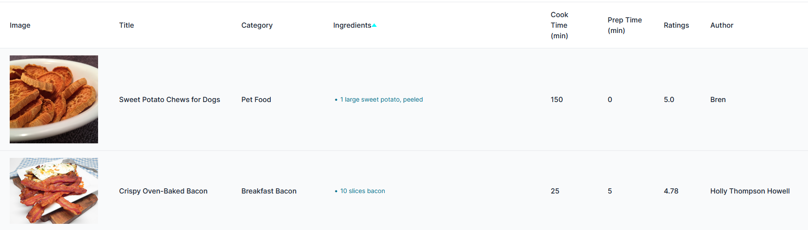

# Recipe Finder

## Hi there 👋 thank you for taking a look at my code!

I'm Francisco Castanho and I will take this opportunity to leave some details to make going trough this work easier.

The application is deployed [here](https://recipe-finder-blue-darkness-8237.fly.dev/).

## What features are available?

- When accessing the application the user will be presented with the firstly found recipes in the database.

- They can type the ingredients they have at home in the search bar. Common separators like commas can be used in the query as they will be cleaned from it.

- The user can either click *Submit*, to search for recipes that have those ingredients in the title, category and the ingredients list.

- Or click *Clean* at any point to reset the search field and the recipes list.


- Recipes can be sorted and the fields supported are: Title, Category, Ingredients(number of ingredients), Cook Time, Prep Time, Ratings and Author.



- Recipes are also paginated. Just click on the numbered buttons to jump to a page. Or in the *<* *>* buttons to jump to the first and last pages respectively.


## 📖 User Stories

*As a Cook, I want to type the ingredients I have available, so that I learn more recipes, know who made them and how they look like.*

*As a Cook, I want to know the recipes with the highest rating, so that I can cook the best recipes.*

*As a Cook, I want to know what recipes take the least ingredients, so that I can save money.*

## 🧰 Approach

The objective from the start was to provide the most value to the user as fast as possible. They will be paying and this will allow us to obtain feedback faster, improve and fix bugs too. Furthermore, to not introduce all the features in the world, but those that are, should work very well. The components in the user interface should be intuitive and the user should have easy access to what they want.

The data was not split into multiple tables. It would complitate the process of accessing it. This simplified the business logic while allowing the application to show the recipes that the user wants.

Over-normalizing a database can hurt performance by creating too many tables and joins, leading to increased disk operations, network traffic, and memory usage. It can also weaken the effectiveness of indexes, caching, and partitioning, resulting in slower queries, higher resource consumption, and reduced scalability.

This project uses GIN indexes and pg_search with a dynamically updated tsvector column for efficient full-text searches.

This approach avoids slow linear database scans by leveraging advanced indexing but requires more disk space and memory.

While this application doesn’t modify data, updates would be slower because the index nodes must be adjusted, and the tsvector is recalculated through a trigger.

Other than that, the code should be simple enough to comment itself. 👍

## 👷 Some future work & limitations

- Support more languages besides english.
- Allow typos in the search query.
- More unit tests could have been written.
- The application does not include any protection against malitious use (rate-limiting for example) other than what the dependencies provide.
- The user interface is not responsive.
- When the user does not find any recipes, perhaps recommendations could have been shown to set him/her in the right track.
- (...)

## How to run locally

If `docker` and `docker-compose` are available. All that should be needed is to run:

```bash
docker-compose up
```

## Optionally, to run bare metal 🤘:

1 - Ruby 3.3.6 is installed.

2 - Postgres 16 is installed.

3 - Environment variables in `.env` are loaded.

From here run:

```bash
chmod a+x ./bin/* # ensure the scripts inside `/bin` have execution permissions
bin/setup
```

## Problem statement

#### **_It's dinner time ! Create an application that helps users find the most relevant recipes that they can prepare with the ingredients that they have at home_**

## Objective

Deliver a prototype web application to answer the above problem statement.

| :white_check_mark: Must have's      | :stop_sign: Don'ts                                       |
| ----------------------------------- | -------------------------------------------------------- |
| A back-end with Ruby on Rails       | Excessive effort in styling                              |
| A SQL-compliant relational database | Features which don't directly answer the above statement |
| A well-thought user experience      | Over-engineer your prototype                             |
| A good code quality                 |

## Deliverable

- [X] The codebase: hosted on GitHub and shared with: @soyoh @sforsell @clemalfroy @dmilon @pointcom @evangelos-fotis @thecodehunter @gterral @sirdharma @maximilientyc @by-robots @NikosVlagoidis @toommz @foreverhungry @mandark97 @technoir9,
- [X] 2 or 3 user stories that address the statement in the repo's `README.md`,
- [X] The application accessible online (a personal server, fly.io or something else),
- [X] Submission of the above via [this form](https://forms.gle/siH7Rezuq2V1mUJGA),
- [X] If you're on Mac, make sure your browser has permission to share the screen.


## Data
We provide two datasets to choose from:
- [french-language recipes](https://pennylane-interviewing-assets-20220328.s3.eu-west-1.amazonaws.com/recipes-fr.json.gz) scraped from www.marmiton.org with [python-marmiton](https://github.com/remaudcorentin-dev/python-marmiton)
- [english-language recipes](https://pennylane-interviewing-assets-20220328.s3.eu-west-1.amazonaws.com/recipes-en.json.gz) scraped from www.allrecipes.com with [recipe-scrapers](https://github.com/hhursev/recipe-scrapers)

Download it with this command if the above link doesn't work:
```shell
wget https://pennylane-interviewing-assets-20220328.s3.eu-west-1.amazonaws.com/recipes-en.json.gz && gzip -dc recipes-en.json.gz > recipes-en.json
```

## The debrief interview

Do we want to fill this ?

## FAQ

<details>
<summary><i>I'm a back-end developper or don't know React, what do I do?</i></summary>

Just make the simplest UI, style isn't important and server rendered HTML pages will do!
</details>

<details>
<summary><i>Can I have a time extension for the test?</i></summary>

No worries, we know that unforeseen events happen, simply reach out to the recruiter you've been
talking with to discuss this.
</details>

<details>
<summary><i>Can I transform the dataset before seeding it in the DB</i></summary>

Absolutely, feel free to post-process the dataset as needed to fit your needs.
</details>

<details>
<summary><i>Should I rather implement option X or option Y</i></summary>

That decision is up to you and part of the challenge. Please document your choice
to be able to explain your reflexion and choice to your interviewer for the
challenge debrief.
</details>

<details>
<summary><i>I tried to make it available online but can't make it work</i></summary>

Don't overinvest time (or money) on this if you really can't figure it out and we'll
assess over your local version. Please make sure eveything is working smoothly
locally before your debrief interview.
</details>
